# 🔍 Hotel System Diagnostic Report
**Date:** 2025-09-30  
**Investigation Focus:** Room Status Logic & Check-in/Check-out Inconsistencies

---

## 🎯 Executive Summary

After deep investigation of the hotel management system's backend (Supabase functions) and frontend (React components), we identified **5 critical issues** causing inconsistent room status behavior and check-in/checkout problems.

---

## 🚨 Critical Issues Identified

### Issue #1: Reserved Room Check-in Blocked by Atomic Function
**Severity:** 🔴 CRITICAL  
**Status:** Found Root Cause

#### Problem
The `atomic_checkin_guest` database function explicitly BLOCKS check-in for rooms with status 'reserved':

```sql
-- Line 79-83 in atomic_checkin_guest function
IF v_room_status NOT IN ('available', 'ready', 'vacant') THEN
  RETURN QUERY SELECT false, NULL::uuid, NULL::uuid, NULL::uuid, NULL::uuid, 
    ('Room is ' || v_room_status || ' and cannot be assigned')::text;
  RETURN;
END IF;
```

**Why This Causes \"Room reserved and cannot be assigned\" Error:**
- When a room is RESERVED and a user tries to check in the guest
- The atomic function checks room status
- Status = 'reserved' → NOT IN ('available', 'ready', 'vacant')
- Function returns error: \"Room is reserved and cannot be assigned\"

**Expected Flow:**
```
Reserved Room → Check-in Guest → Room becomes Occupied
```

**Actual Flow (BROKEN):**
```
Reserved Room → Check-in Guest → ❌ ERROR: \"Room is reserved and cannot be assigned\"
```

#### Root Cause
The function validation logic **contradicts the business flow** where reserved rooms SHOULD be checked in.

#### Solution
Update `atomic_checkin_guest` to allow check-in for reserved rooms:
```sql
-- FIXED VERSION:
IF v_room_status NOT IN ('available', 'ready', 'vacant', 'reserved') THEN
  RETURN QUERY SELECT false, NULL::uuid, NULL::uuid, NULL::uuid, NULL::uuid, 
    ('Room is ' || v_room_status || ' and cannot be assigned')::text;
  RETURN;
END IF;
```

---

### Issue #2: Overstay Detection Triggers Immediately on Same-Day Check-in
**Severity:** 🟠 HIGH  
**Status:** Found Root Cause

#### Problem
Client-side overstay detection in `RoomGrid.tsx` (lines 99-113) uses a flawed comparison:

```typescript
// Current (BROKEN) logic:
const checkoutDateTime = new Date(room.current_reservation.check_out_date + 'T12:00:00');
const now = new Date();

if (now > checkoutDateTime) {
  mappedStatus = 'overstay';
}
```

**Scenario that triggers bug:**
1. Guest checks in on **September 30 at 11:00 AM**
2. Checkout date is **September 30**
3. Checkout time is **12:00 PM** (noon)
4. Current time is **11:05 AM**
5. Code creates: `checkoutDateTime = \"2025-09-30T12:00:00\"`
6. Comparison: `11:05 AM > 12:00 PM` = FALSE (correct)
7. ✅ NOT marked as overstay (CORRECT)

**BUT if clock is 12:01 PM:**
8. Current time is **12:01 PM**
9. Comparison: `12:01 PM > 12:00 PM` = TRUE
10. ❌ MARKED AS OVERSTAY (INCORRECT - guest just checked in 1 hour ago!)

#### Why This Happens
The comparison uses **check_out_date** (which is TODAY) + 12:00 PM, so any check-in after noon on the checkout date immediately triggers overstay.

#### Root Cause
**Date-only checkout field** combined with **time-based comparison** creates ambiguity for same-day check-in/out scenarios.

#### Solution
Use the DB function `calculate_reservation_overstay` which properly considers:
- Hotel timezone
- Checkout time (12:00 PM)
- Full datetime comparison
- Grace periods

**Replace client-side logic with:**
```typescript
// Use DB function instead of client calculation
const { data: isOverstay } = await supabase.rpc('calculate_reservation_overstay', {
  p_reservation_id: room.current_reservation.id
});
```

---

### Issue #3: Multiple Success/Error Toasts from Dual Hooks
**Severity:** 🟡 MEDIUM  
**Status:** Found Root Cause

#### Problem
`QuickGuestCapture.tsx` uses **TWO separate check-in mechanisms**:

```typescript
// Line 58: Hook #1
const { checkIn: atomicCheckIn } = useAtomicCheckIn();

// Line 135: Hook #2  
const { quickCheckIn } = useRoomStatusManager();
```

**Code flow shows conflicting paths:**

```typescript
// Path 1: Atomic check-in (lines 495-506)
const result = await atomicCheckIn({...});
if (!result.success) {
  throw new Error(result.message);  // Shows error toast
}

// Path 2: Manual updates after atomic (lines 600-608)
updatedRoom.status = 'occupied';  // Direct state mutation
queryClient.invalidateQueries({ queryKey: ['rooms'] });  // Triggers refetch

// Path 3: Success toast (lines 621-630)
toast({
  title: \"Processing Complete\",
  description: `Check-in completed for ${formData.guestName}`
});
```

#### Why Multiple Toasts Appear
1. **Atomic function fails** → Error toast from catch block (line 688)
2. **State gets partially updated** → Room status changes in UI
3. **Query invalidation triggers** → Real-time updates show success
4. **User sees:** \"Failed to process guest information\" + \"Check-in successful\"

#### Root Cause
**Mixed transaction handling** - Some operations use atomic DB functions, others use manual multi-step updates.

#### Solution
**Use ONLY atomic functions** for all check-in/checkout operations. Remove manual state updates.

---

### Issue #4: Room Status Validation Mismatch
**Severity:** 🟡 MEDIUM  
**Status:** Design Inconsistency

#### Problem
**Database function** allows these statuses for check-in:
```sql
IF v_room_status NOT IN ('available', 'ready', 'vacant') THEN
```

**Frontend validation** in `useRoomStatusManager` allows:
```typescript
const allowedTransitions = {
  'reserved': ['occupied', 'available'],  // ✅ Reserved → Occupied allowed
  'available': ['occupied', 'reserved', 'dirty', 'maintenance', 'oos'],
  // ...
};
```

**Mismatch:** Backend rejects 'reserved' → 'occupied', frontend allows it.

#### Root Cause
Backend and frontend validation rules **not synchronized**.

#### Solution
Align backend function with frontend validation rules:
```sql
-- Allow reserved rooms to be checked in
IF v_room_status NOT IN ('available', 'ready', 'vacant', 'reserved') THEN
```

---

### Issue #5: Realtime Updates Don't Invalidate Overstay Status
**Severity:** 🟡 MEDIUM  
**Status:** Missing Implementation

#### Problem
`useFrontDeskRealtimeUpdates.ts` invalidates queries on room/reservation changes:

```typescript
// Lines 28-33: Room changes
queryClient.invalidateQueries({ queryKey: ['rooms', tenant.tenant_id] });
queryClient.invalidateQueries({ queryKey: ['room-availability', tenant.tenant_id] });
```

**BUT:** Overstay status is calculated client-side in `RoomGrid.tsx`, not from the database.

#### Why This Is a Problem
1. Room status changes in DB (e.g., checkout extended)
2. Real-time event fires
3. Rooms query is invalidated and refetched
4. **Overstay calculation still uses stale check_out_date** from previous render
5. UI shows incorrect overstay status until manual refresh

#### Root Cause
**Client-side overstay calculation** not synchronized with **server-side data changes**.

#### Solution
1. Move overstay calculation to server (already done: `calculate_reservation_overstay`)
2. Add overstay query key to real-time invalidation:
```typescript
queryClient.invalidateQueries({ queryKey: ['overstays', tenant.tenant_id] });
```

---

## 📊 Data Flow Analysis

### Current (Broken) Check-in Flow

```mermaid
sequenceDiagram
    participant UI as Frontend UI
    participant Hook as useAtomicCheckIn
    participant DB as atomic_checkin_guest
    participant State as React State
    
    UI->>Hook: Check in reserved room
    Hook->>DB: Call atomic_checkin_guest
    DB->>DB: Check room status = 'reserved'
    DB-->>Hook: ❌ Error: Room is reserved
    Hook-->>UI: Show error toast
    
    Note over UI: Meanwhile, parallel code path:
    UI->>State: Update room status locally
    State-->>UI: Show success (stale data)
    
    UI->>UI: Show BOTH error AND success
```



### Fixed Check-in Flow

```mermaid
sequenceDiagram
    participant UI as Frontend UI
    participant Hook as useAtomicCheckIn
    participant DB as atomic_checkin_guest
    participant RT as Realtime
    
    UI->>Hook: Check in reserved room
    Hook->>DB: Call atomic_checkin_guest
    DB->>DB: ✅ Allow reserved → occupied
    DB->>DB: Update in single transaction
    DB-->>Hook: ✅ Success
    Hook->>RT: Invalidate queries
    RT-->>UI: Refetch room data
    Hook-->>UI: Show ONE success toast
```



---

## 🔧 Required Fixes

### Priority 1: Database Function Fix (Immediate)
**File:** `supabase/migrations/*.sql`  
**Function:** `atomic_checkin_guest`

```sql
-- BEFORE (Line 79):
IF v_room_status NOT IN ('available', 'ready', 'vacant') THEN

-- AFTER:
IF v_room_status NOT IN ('available', 'ready', 'vacant', 'reserved') THEN
```

**Also update reservation status check** (Line 97):
```sql
-- BEFORE:
IF v_reservation_status NOT IN ('confirmed', 'pending') THEN

-- AFTER:  
IF v_reservation_status NOT IN ('confirmed', 'pending', 'soft_hold') THEN
```

---

### Priority 2: Remove Client-Side Overstay Logic
**File:** `src/components/frontdesk/RoomGrid.tsx`  
**Lines:** 99-113

```typescript
// REMOVE THIS ENTIRE BLOCK:
if (room.status === 'occupied' && room.current_reservation) {
  const checkoutDateTime = new Date(room.current_reservation.check_out_date + 'T12:00:00');
  const now = new Date();
  if (now > checkoutDateTime) {
    mappedStatus = 'overstay';
  }
}

// REPLACE WITH:
// Overstay status is now managed by useOverstays hook
// and calculated server-side using calculate_reservation_overstay
```

---

### Priority 3: Consolidate Check-in to Single Hook
**File:** `src/components/frontdesk/QuickGuestCapture.tsx`

```typescript
// REMOVE:
const { quickCheckIn } = useRoomStatusManager();  // Line 135

// KEEP ONLY:
const { checkIn: atomicCheckIn } = useAtomicCheckIn();  // Line 134

// Use atomicCheckIn for ALL check-in operations
```

---

### Priority 4: Add Overstay to Realtime Invalidation
**File:** `src/hooks/useFrontDeskRealtimeUpdates.ts`

```typescript
// Add to reservation change handler (Line 47):
queryClient.invalidateQueries({ queryKey: ['reservations', tenant.tenant_id] });
queryClient.invalidateQueries({ queryKey: ['rooms', tenant.tenant_id] });
queryClient.invalidateQueries({ queryKey: ['overstays', tenant.tenant_id] });  // ADD THIS
```

---

## ✅ Acceptance Criteria

### Test Case 1: Reserved Room Check-in
```
Given: Room 101 is RESERVED with guest \"John Doe\"
When: Front desk clicks \"Check-In\" for Room 101
Then: 
  ✅ Room status changes to OCCUPIED
  ✅ ONE success toast appears
  ✅ No error messages
  ✅ Folio is created
  ✅ Guest data is saved
```

### Test Case 2: Same-Day Checkout Overstay
```
Given: Guest checks in on Sep 30 at 10:00 AM
And: Checkout date is Sep 30
And: Checkout time is 12:00 PM
When: Clock is 11:30 AM (before checkout)
Then: 
  ✅ Room status is OCCUPIED
  ✅ No overstay badge shown
  
When: Clock is 12:01 PM (after checkout)
Then:
  ✅ Room status changes to OVERSTAY
  ✅ Overstay badge appears
```

### Test Case 3: Checkout with Outstanding Balance
```
Given: Guest in Room 101 has ₦5,000 balance
When: Front desk attempts checkout
Then:
  ✅ Checkout blocked
  ✅ Error: \"Outstanding balance must be settled\"
  ✅ Balance amount displayed
  ✅ \"Settle Bills\" button enabled
```

### Test Case 4: Successful Checkout
```
Given: Guest in Room 101 has ₦0 balance
When: Front desk clicks \"Check-Out\"
Then:
  ✅ Atomic checkout completes
  ✅ Room status → DIRTY
  ✅ Folio status → CLOSED
  ✅ Reservation status → CHECKED_OUT
  ✅ ONE success toast
  ✅ Modal closes automatically
```

---

## 📈 Payment Flow Validation

### Current Payment Logic
**File:** `src/components/frontdesk/CheckoutDialog.tsx`  
**Lines:** 56-65

```typescript
const handlePaymentSuccess = async (amount: number, method: string) => {
  const success = await processPayment(amount, method);
  if (success) {
    toast({ title: \"Payment Processed\" });
    setShowPayment(false);
  }
};
```

**Validated:** ✅ Payment is recorded before checkout is allowed.

### Payment Constraint Issue
**Database:** `payments` table has constraint:
```sql
CONSTRAINT payments_payment_method_check 
CHECK (payment_method IN ('cash', 'card', 'transfer', 'mobile_money'))
```

**Frontend sends:**
- \"POS\" → ❌ Constraint violation
- \"Moniepoint POS\" → ❌ Constraint violation

**Fix:** Map frontend payment methods to DB enum:
```typescript
const paymentMethodMap = {
  'POS': 'card',
  'Moniepoint POS': 'card',
  'Bank Transfer': 'transfer',
  'Mobile Money': 'mobile_money',
  'Cash': 'cash'
};
```

---

## 🏗️ Unified Workflow Recommendation

### Correct Status Flow
```
Reserve → Check-in → Occupied → Checkout → Dirty → Clean → Available
                                      ↓
                                  (if past checkout time)
                                      ↓
                                  Overstay
```

### Implementation Strategy
1. ✅ **Use atomic functions ONLY** - No manual multi-step operations
2. ✅ **Server-side calculations** - Overstay, balance, status transitions
3. ✅ **Single source of truth** - Database functions, not client state
4. ✅ **Consistent validation** - Same rules in DB and frontend
5. ✅ **Real-time sync** - Invalidate ALL affected queries

---

## 📝 Deployment Checklist

- [ ] Run migration to fix `atomic_checkin_guest` (add 'reserved' status)
- [ ] Remove client-side overstay calculation in `RoomGrid.tsx`
- [ ] Remove `useRoomStatusManager` import from `QuickGuestCapture.tsx`
- [ ] Add overstay invalidation to real-time updates
- [ ] Add payment method mapping in payment dialog
- [ ] Test all 4 acceptance criteria
- [ ] Monitor Supabase logs for `atomic_checkin_guest` calls
- [ ] Verify no duplicate toasts appear in production

---

## 🎬 Conclusion

All 5 issues have **identifiable root causes** and **clear solutions**. The primary problem is **inconsistent validation** between database functions and frontend logic, combined with **mixed transaction handling** (some atomic, some multi-step).

**Recommended approach:** Implement all Priority 1-4 fixes in a single deployment to ensure consistency across the system.

**Estimated fix time:** 2-4 hours  
**Testing time:** 1-2 hours  
**Total:** 3-6 hours for complete resolution
