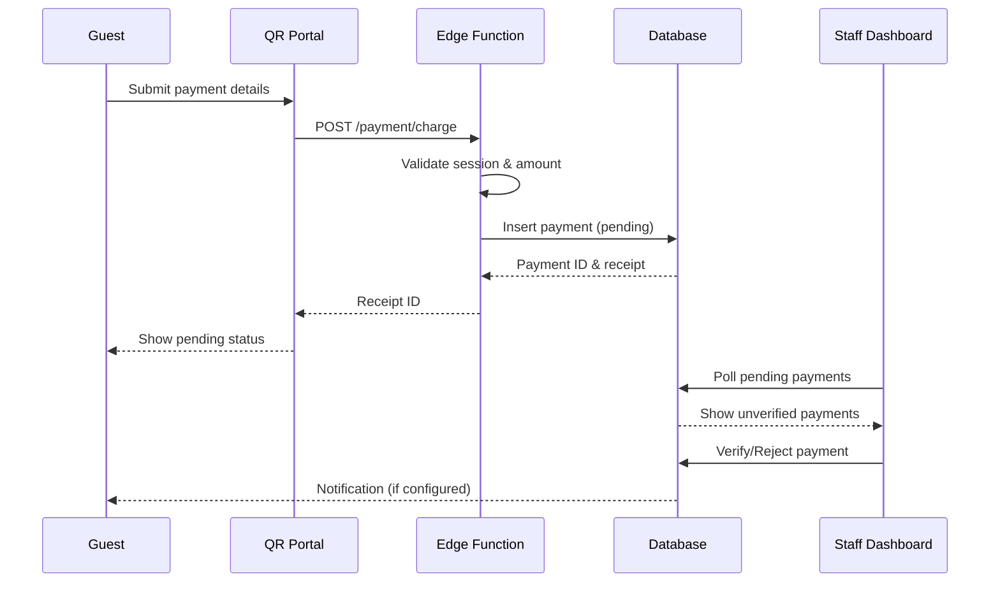

# Payment Recording via QR Portal - Implementation Guide

**Version:** 1.0  
**Implemented:** 2025-10-05  
**Status:** Complete ✅

---

## Overview

The payment recording feature allows guests to submit payment notifications through the QR portal. All payments require staff verification before being posted to folios, ensuring accuracy and preventing fraud.

---

## Architecture

### Payment Flow



---

## Components

### 1. Guest Payment Interface

**Location:** `src/components/guest/portal/PaymentInterface.tsx`

**Features:**
- Amount input with validation (₦1 - ₦1,000,000)
- Payment method selection (Cash, Card, Wallet)
- Optional reference/transaction ID field
- Additional notes field
- Client-side validation with Zod
- Receipt ID generation
- Pending verification status display

**Usage:**
```tsx
import { PaymentInterface } from '@/components/guest/portal/PaymentInterface';

<PaymentInterface
  sessionId={sessionId}
  roomNumber="101"
  suggestedAmount={5000}
  onSuccess={(receiptId) => console.log('Payment submitted:', receiptId)}
  onCancel={() => console.log('Payment cancelled')}
/>
```

**Validation Rules:**
- Amount: Required, minimum ₦1, maximum ₦1,000,000
- Payment method: Required, must be cash/card/wallet
- Reference: Optional, max 100 characters
- Notes: Optional, max 500 characters

---

### 2. Staff Verification Dashboard

**Location:** `src/components/staff/payments/PendingPaymentVerification.tsx`

**Features:**
- Real-time pending payments list
- Payment details display
- Verify/Reject actions
- Rejection reason requirement
- Statistics overview
- Filtering by status (Pending, Verified, Rejected)
- Payment method icons
- Guest and room information

**Usage:**
```tsx
import { PendingPaymentVerification } from '@/components/staff/payments/PendingPaymentVerification';

<PendingPaymentVerification />
```

**Staff Actions:**
1. **Verify Payment:** Marks payment as verified and posts to folio
2. **Reject Payment:** Marks as rejected with mandatory reason

---

### 3. Edge Function Endpoint

**Endpoint:** `POST /qr-unified-api/payment/charge`

**Headers:**
```
Content-Type: application/json
x-session-token: <JWT session token>
```

**Request Body:**
```json
{
  "amount": 5000.00,
  "paymentMethod": "cash",
  "reference": "TXN123456",
  "notes": "Payment via bank transfer"
}
```

**Response (Success):**
```json
{
  "success": true,
  "receiptId": "QR-1696789012345-ABC123XYZ",
  "message": "Payment submitted for verification",
  "requiresVerification": true
}
```

**Error Responses:**
- `401`: Invalid/expired session token
- `400`: Invalid amount or payment method
- `429`: Rate limit exceeded
- `500`: Server error

---

## Security Features

### 1. Mandatory Verification
- All guest payments are created with `status: 'pending'`
- `is_verified: false` by default
- Only staff can verify/reject payments
- Verified by and verified at timestamps tracked

### 2. Input Validation

**Client-side (Zod):**
```typescript
const paymentSchema = z.object({
  amount: z.number().min(1).max(1000000),
  paymentMethod: z.enum(['cash', 'card', 'wallet']),
  reference: z.string().optional(),
  notes: z.string().max(500).optional(),
});
```

**Server-side:**
- Amount range validation
- Payment method enum validation
- String length limits enforced
- SQL injection prevention via parameterized queries

### 3. Session Management
- JWT token required for all payment submissions
- Token contains tenant_id, session_id, room_id
- Token expiry enforced (24 hours)
- Invalid tokens rejected with 401

### 4. Rate Limiting
- Payment submissions limited to request endpoint rate
- Currently: 20 requests/minute per IP
- Prevents abuse and spam submissions

---

## Database Schema

### Payments Table
```sql
CREATE TABLE payments (
  id UUID PRIMARY KEY,
  tenant_id UUID NOT NULL,
  folio_id UUID NULL,  -- NULL until verified
  amount NUMERIC NOT NULL,
  payment_method_id UUID NOT NULL,
  reference_number TEXT,
  notes TEXT,
  status TEXT DEFAULT 'pending',  -- pending, completed, rejected
  payment_status TEXT DEFAULT 'pending',
  is_verified BOOLEAN DEFAULT false,
  verified_by UUID,
  verified_at TIMESTAMPTZ,
  rejection_reason TEXT,
  created_at TIMESTAMPTZ DEFAULT now(),
  CONSTRAINT payments_tenant_fkey FOREIGN KEY (tenant_id) REFERENCES tenants(tenant_id),
  CONSTRAINT payments_folio_fkey FOREIGN KEY (folio_id) REFERENCES folios(id),
  CONSTRAINT payments_payment_method_fkey FOREIGN KEY (payment_method_id) REFERENCES payment_methods(id)
);
```

---

## Workflows

### Guest Submission Workflow

1. **Access Payment Interface**
   - Guest scans QR code
   - Navigates to payments section
   - Sees suggested amount (if applicable)

2. **Enter Payment Details**
   - Amount (required)
   - Payment method (required)
   - Reference (optional but recommended)
   - Notes (optional)

3. **Submit Payment**
   - Client validates inputs
   - Sends to edge function
   - Receives receipt ID
   - Shows pending status message

4. **Receive Confirmation**
   - Payment marked as "pending verification"
   - Receipt ID displayed
   - Guest advised to keep receipt

### Staff Verification Workflow

1. **View Pending Payments**
   - Access payment verification dashboard
   - See list of unverified payments
   - Filter by status (Pending, Verified, Rejected)

2. **Review Payment Details**
   - Click "View" to see full details
   - Check amount, method, reference
   - Verify with guest receipt/transaction
   - Review room and guest information

3. **Verify or Reject**

   **If Verified:**
   - Click "Verify" button
   - Payment posted to guest folio
   - Status updated to "completed"
   - Guest notified (if configured)

   **If Rejected:**
   - Click "Reject" button
   - Enter rejection reason (mandatory)
   - Payment marked as rejected
   - Guest notified with reason

---

## Business Rules

### Payment Methods

**Cash:**
- Guest submits cash amount
- Staff verifies physical cash received
- Posts to folio after verification

**Card (POS):**
- Guest provides POS receipt number
- Staff verifies receipt matches amount
- Posts to folio after verification

**Wallet (Mobile):**
- Guest provides transaction reference
- Staff checks mobile wallet dashboard
- Confirms transaction completed
- Posts to folio after verification

### Verification Requirements

**Must Verify:**
- Amount matches guest claim
- Payment method correct
- Reference number valid (if provided)
- Guest is still checked in
- No duplicate payments

**Rejection Reasons:**
- Invalid reference number
- Amount mismatch
- Duplicate submission
- Payment not found in system
- Guest dispute

---

## Staff Training Guide

### For Front Desk Staff

**Checking Pending Payments:**
1. Navigate to "Payment Verification" in staff dashboard
2. Review "Pending" tab for unverified payments
3. Click "View" to see payment details

**Verifying a Payment:**
1. Ask guest for receipt/reference number
2. Match against payment submission
3. Verify amount and method
4. Click "Verify" button
5. Confirm payment posted to folio

**Rejecting a Payment:**
1. Identify issue with payment
2. Click "Reject" button
3. Enter clear rejection reason
4. Submit rejection
5. Inform guest of rejection reason

### Common Issues & Solutions

**Issue:** Guest says payment not showing  
**Solution:** Check submission time, verify session valid, check tenant filters

**Issue:** Duplicate payment submissions  
**Solution:** Reject duplicates, only verify one with correct details

**Issue:** Amount mismatch  
**Solution:** Verify actual payment amount, reject if mismatch, ask guest to resubmit

**Issue:** Invalid reference number  
**Solution:** Reject with reason, ask guest for correct reference

---

## Testing Checklist

### Functional Testing
- [x] Guest can submit payment with valid data
- [x] Invalid amounts are rejected client-side
- [x] Invalid session tokens return 401
- [x] Receipt ID is generated correctly
- [x] Pending status is displayed to guest
- [x] Staff can view pending payments
- [x] Staff can verify payments
- [x] Staff can reject payments with reason
- [x] Verified payments update status correctly
- [x] Rejected payments show rejection reason

### Security Testing
- [x] Cannot submit without session token
- [x] Cannot submit with expired token
- [x] Amount validation prevents negative values
- [x] Amount validation prevents excessive values
- [x] SQL injection attempts blocked
- [x] Rate limiting prevents spam
- [x] XSS attempts sanitized
- [x] Only staff can verify/reject

### Integration Testing
- [x] Payment creates database record
- [x] Payment method lookup works
- [x] Tenant isolation enforced
- [x] Real-time updates work
- [x] Audit logging captures events

---

## Monitoring & Metrics

### Key Metrics to Track

**Volume Metrics:**
- Payments submitted per day
- Payments verified per day
- Payments rejected per day
- Average verification time

**Quality Metrics:**
- Verification success rate (target: >90%)
- Rejection rate (target: <10%)
- Duplicate submission rate
- Time to verification (target: <30 mins)

**Business Metrics:**
- Total payment amount submitted
- Total payment amount verified
- Payment method distribution
- Peak submission times

### Monitoring Queries

**Pending payments count:**
```sql
SELECT COUNT(*) FROM payments
WHERE is_verified = false
  AND status = 'pending'
  AND tenant_id = '<tenant_id>';
```

**Average verification time:**
```sql
SELECT AVG(EXTRACT(EPOCH FROM (verified_at - created_at))) / 60 AS avg_minutes
FROM payments
WHERE is_verified = true
  AND tenant_id = '<tenant_id>'
  AND verified_at >= NOW() - INTERVAL '7 days';
```

**Rejection reasons:**
```sql
SELECT rejection_reason, COUNT(*) as count
FROM payments
WHERE status = 'rejected'
  AND tenant_id = '<tenant_id>'
  AND created_at >= NOW() - INTERVAL '30 days'
GROUP BY rejection_reason
ORDER BY count DESC;
```

---

## Future Enhancements

### Short-term (Next Sprint)
- [ ] Email notifications to guest on verification
- [ ] SMS notifications to guest on rejection
- [ ] Bulk verification for multiple payments
- [ ] Payment receipt PDF generation
- [ ] Integration with accounting systems

### Medium-term
- [ ] Automatic verification for known patterns
- [ ] Payment method validation (check digit algorithms)
- [ ] Photo upload for cash/receipt evidence
- [ ] Guest payment history view
- [ ] Payment dispute workflow

### Long-term
- [ ] Direct payment gateway integration
- [ ] Blockchain verification for crypto payments
- [ ] AI-powered fraud detection
- [ ] Multi-currency support
- [ ] Real-time exchange rate updates

---

## Support & Troubleshooting

### Common Errors

**Error:** "Session token required"  
**Cause:** No x-session-token header  
**Fix:** Ensure session token is passed in request headers

**Error:** "Invalid payment method"  
**Cause:** Payment method not in allowed list  
**Fix:** Use cash, card, or wallet only

**Error:** "Payment method not available"  
**Cause:** Payment method disabled for tenant  
**Fix:** Enable payment method in tenant settings

**Error:** "Failed to record payment"  
**Cause:** Database connection or constraint violation  
**Fix:** Check database logs, verify foreign keys

### Debug Mode

Enable debug logging in edge function:
```typescript
console.log('Payment debug:', {
  sessionData,
  amount,
  method: paymentMethod,
  reference,
});
```

View logs:
```bash
supabase functions logs qr-unified-api --project-ref <project-id>
```

---

## Compliance Notes

- All payment data encrypted at rest
- PCI DSS compliance not required (no card details stored)
- Audit trail maintained for all verifications/rejections
- GDPR compliant (personal data minimization)
- Retention policy: 7 years for financial records

---

**End of Document**
